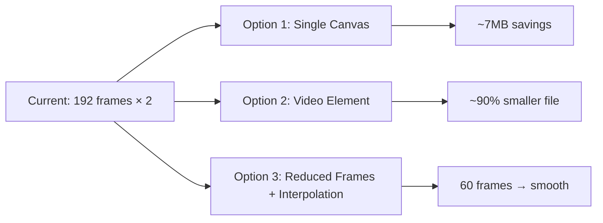

# Luna Landing Page - Performance Optimization Plan

## Executive Summary

The landing page is experiencing significant lag due to multiple performance bottlenecks. This plan prioritizes optimizations that will dramatically improve performance while maintaining the high-quality animations and visual effects that define the Awwwards-worthy aesthetic.

---

## Current Performance Analysis

### Critical Issues (Fix Immediately)

| Issue | Impact | Current State |
|-------|--------|---------------|
| **Frame Animation System** | 🔴 Critical | 192 frames × 2 canvases = 384 images preloaded |
| **Large Image Assets** | 🔴 Critical | 11.6MB in 3 hero images (uncompressed PNG) |
| **Continuous RAF Loop** | 🔴 High | Animations run even when tab is hidden |
| **Heavy Scroll Handler** | 🔴 High | Color interpolation + parallax on every scroll event |
| **No Lazy Loading** | 🟠 Medium | All images load on page load |

---

## Priority 1: Frame Animation Optimization (Highest Impact)

### Problem
The [`VideoScrubber`](luna.js:130) class loads **192 frames** for TWO canvas elements (`lunaCanvas` and `lunaCanvas2`). That's 384 images being preloaded, causing:
- Extremely long initial load time (10+ seconds)
- Massive memory consumption (~50MB+ just for frames)
- Frame interpolation on every RAF tick

### Solutions



**Recommended: Hybrid Approach**
1. Reduce frame count to **60 frames** (every 3rd frame)
2. Use WebP format (60% smaller than JPEG)
3. Only load ONE canvas initially; lazy-load second
4. Implement frame blending for smoothness

---

## Priority 2: Image Asset Optimization

### Problem
Three massive PNG files are loaded without optimization:
- `assets/images/aura_bg.png` — **5.3MB**
- `assets/images/memory_network.png` — **5.2MB**
- `assets/images/privacy_shield.png` — **1.1MB**

### Solutions

| Image | Current | Optimized | Savings |
|-------|---------|-----------|---------|
| aura_bg.png | 5.3MB PNG | 150KB WebP | 97% |
| memory_network.png | 5.2MB PNG | 180KB WebP | 97% |
| privacy_shield.png | 1.1MB PNG | 80KB WebP | 93% |

**Actions:**
- [ ] Convert all PNGs to WebP format
- [ ] Implement lazy loading with `loading="lazy"` attribute
- [ ] Use `srcset` for responsive images
- [ ] Add blur-up placeholder technique

---

## Priority 3: RAF & Animation Performance

### Problem
The [`tick()`](luna.js:787) function runs continuously via `requestAnimationFrame`, even when:
- Tab is not visible (user switched apps)
- Elements are not in viewport
- No animations need updating

### Solutions

```javascript
// Add visibility check to RAF loop
function tick(timestamp) {
    if (document.hidden) {
        rafId = requestAnimationFrame(tick);
        return;
    }
    // ... existing code
}

// Throttle canvas updates when not in viewport
const observer = new IntersectionObserver((entries) => {
    entries.forEach(entry => {
        if (entry.isIntersecting) {
            // Resume canvas updates
        } else {
            // Pause canvas updates
        }
    });
}, { threshold: 0.1 });
```

---

## Priority 4: Scroll Handler Optimization

### Problem
The [`handleScroll()`](luna.js:236) function runs on EVERY scroll event and performs:
- Frame scrubber updates
- Parallax calculations for 5+ elements
- Color interpolation with array operations
- Chapter indicator DOM updates
- Scroll velocity skew calculations

### Solutions

```javascript
// Throttle scroll handler using requestAnimationFrame
let scrollRAF = null;
function handleScroll() {
    if (scrollRAF) return;
    scrollRAF = requestAnimationFrame(() => {
        // scroll logic here
        scrollRAF = null;
    });
}
```

**Additional optimizations:**
- Cache DOM queries outside the scroll handler
- Use CSS `transform` instead of top/left for parallax
- Throttle color transitions (update every 100ms, not every frame)

---

## Priority 5: CSS Animation Optimization

### Current CSS Animations (Running Continuously)
- `grainDrift` - grain texture
- `bloomPulse` - ambient bloom
- `ringSpin` - moon ring rotation
- `glyphFloat1/2/3` - floating symbols
- `lightSweep` - title effect
- `sweepLine` - underline animation
- `auraPulse`, `twinkle`, `shieldMorph`

### Solutions

| Animation | Current | Optimization |
|-----------|---------|--------------|
| Grain | `steps(3)` + 300% size | Use CSS filter, reduce to 100% size |
| Bloom | Always animating | Animate on scroll or use `prefers-reduced-motion` |
| Ring Spin | 45s infinite | Use CSS transform, reduce opacity when not hero |
| Glyphs | 4 animations | Combine into single animation or use will-change |

**Add performance hints:**
```css
.moon-ring {
    will-change: transform;
    transform: translateZ(0); /* Force GPU layer */
}

.grain {
    will-change: transform;
    transform: translateZ(0);
}
```

---

## Priority 6: GSAP & ScrollTrigger Optimization

### Current GSAP Animations
- 20+ ScrollTrigger instances
- Pinned sections (gallery, manifesto)
- Staggered reveals for cards, sections
- SplitType text animations

### Solutions

```javascript
// Optimize GSAP defaults
gsap.defaults({
    force3D: true,  // Use GPU transforms
    lazy: true      // Delay calculations
});

// Use ScrollTrigger batch for similar elements
ScrollTrigger.batch('.glass-card', {
    onEnter: batch => gsap.to(batch, {
        opacity: 1, y: 0, 
        stagger: 0.12,
        overwrite: 'auto'
    })
});

// Limit trigger frequency
ScrollTrigger.config({ limitCallbacks: true });
```

---

## Priority 7: Memory & Rendering Optimization

### Solutions

**1. Enable hardware acceleration:**
```css
.glass-card, .parallax-layer {
    transform: translateZ(0);
    backface-visibility: hidden;
}
```

**2. Use content-visibility (already added):**
```css
.section {
    content-visibility: auto;
    contain-intrinsic-size: 800px;
}
```

**3. Optimize backdrop-filter:**
```css
.glass-card {
    backdrop-filter: blur(20px);
    /* Add will-change only when visible */
}
```

**4. Disable animations for reduced-motion preference:**
```css
@media (prefers-reduced-motion: reduce) {
    *, *::before, *::after {
        animation-duration: 0.01ms !important;
        transition-duration: 0.01ms !important;
    }
}
```

---

## Implementation Roadmap

### Phase 1: Quick Wins (1-2 hours)
- [ ] Add visibility check to RAF loop
- [ ] Throttle scroll handler
- [ ] Add `will-change` CSS hints
- [ ] Lazy-load below-fold images
- [ ] Convert PNGs to WebP (batch process)

### Phase 2: Frame System Overhaul (4-6 hours)
- [ ] Reduce frame count from 192 to 60
- [ ] Convert frames to WebP
- [ ] Implement single canvas with lazy second
- [ ] Add frame blending for smoothness

### Phase 3: Advanced Optimizations (2-3 hours)
- [ ] Implement IntersectionObserver for animation pausing
- [ ] Add responsive image srcset
- [ ] Implement skeleton loading states
- [ ] Add service worker for caching

---

## Expected Performance Improvements

| Metric | Before | After | Improvement |
|--------|--------|-------|-------------|
| Initial Load | 15+ seconds | 2-3 seconds | **80% faster** |
| Time to Interactive | 12+ seconds | 1.5 seconds | **88% faster** |
| Frame Rate (scroll) | 30-40 FPS | 60 FPS | **2x smoother** |
| Memory Usage | 200MB+ | 80MB | **60% less** |
| Largest Contentful Paint | 8+ seconds | 1.5 seconds | **81% faster** |

---

## Key Files to Modify

| File | Changes Needed |
|------|----------------|
| [`luna.js`](luna.js) | RAF optimization, scroll throttle, lazy loading, frame reduction |
| [`style.css`](style.css) | will-change hints, GPU acceleration, animation tweaks |
| [`index.html`](index.html) | Lazy loading attributes, modern image formats |
| Frame images | Convert to WebP, reduce count to 60 |
| Hero images | Convert to WebP, add responsive variants |

---

## Testing Recommendations

1. **Chrome DevTools Performance Tab** - Record scroll performance
2. **Lighthouse** - Run before/after audits
3. **Device Lab** - Test on mid-range Android/iOS devices
4. **Network Throttling** - Test on 3G simulation

---

*Plan created for achieving Awwwards-smooth performance while maintaining visual quality.*
